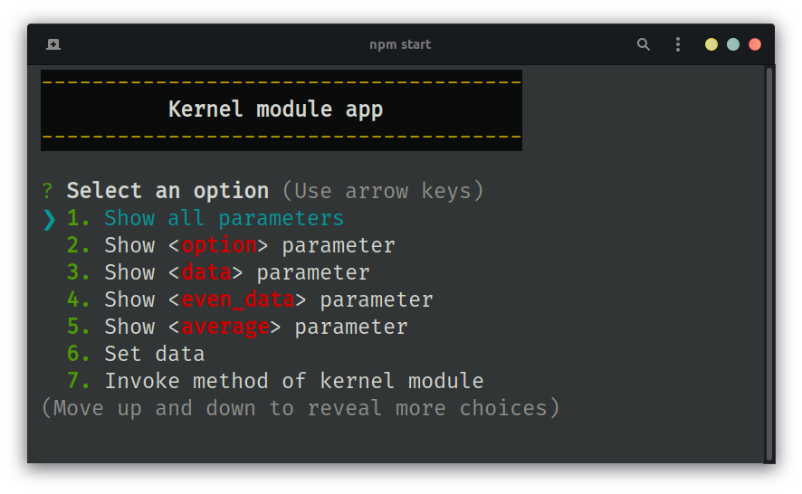
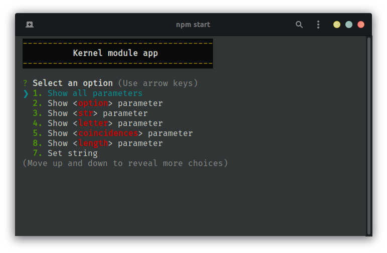

# Kernel Linux Programming
## Description
This repo contains the practices and the lessons viewed in the optional course `ADVANCED COMPUTING SYSTEMS PROGRAMMING` w/ teacher [`@vgarciaortega`](https://github.com/vgarciaortega).

## Practices
1. Module that performs array operations. [GitHub link](https://github.com/JoelHernandez343/kernel-linux-programming/tree/main/practices/01-kernel-thread)

2. Module that performs string operations. [GitHub link](https://github.com/JoelHernandez343/kernel-linux-programming/tree/main/practices/02-strings)

## To-do
- [ ] Create animated gifs instead of multiple screenshots.
